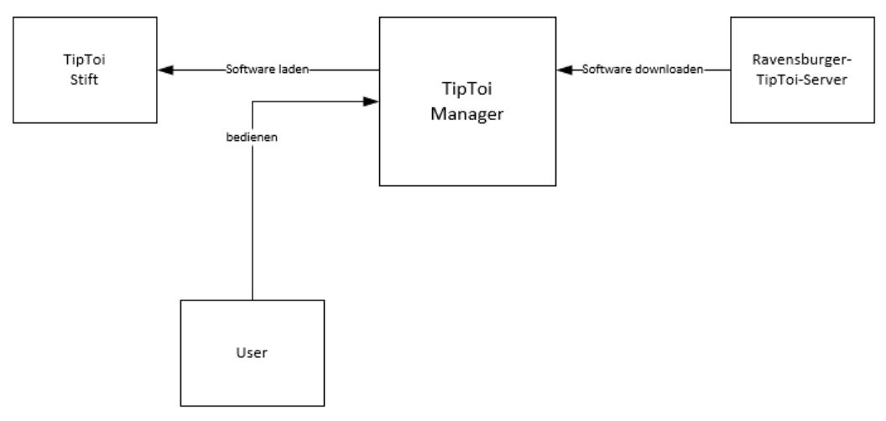
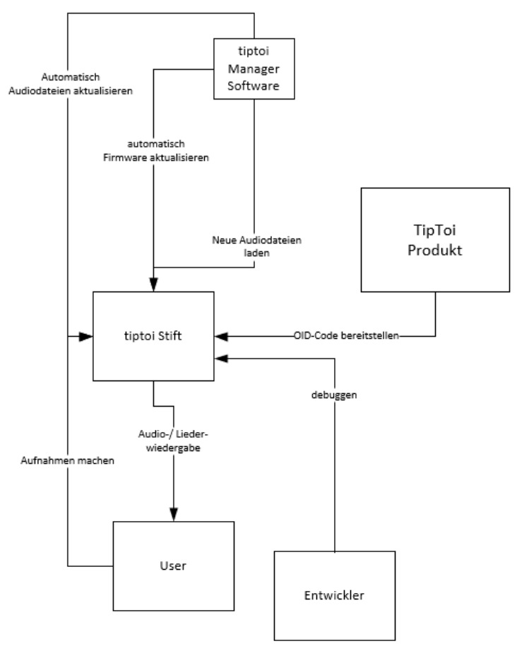
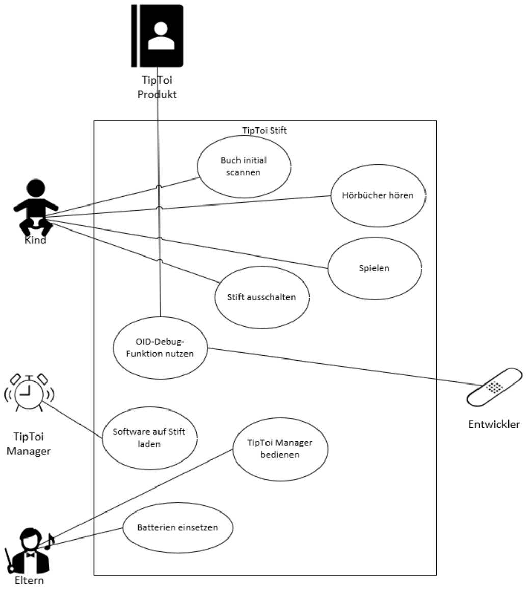
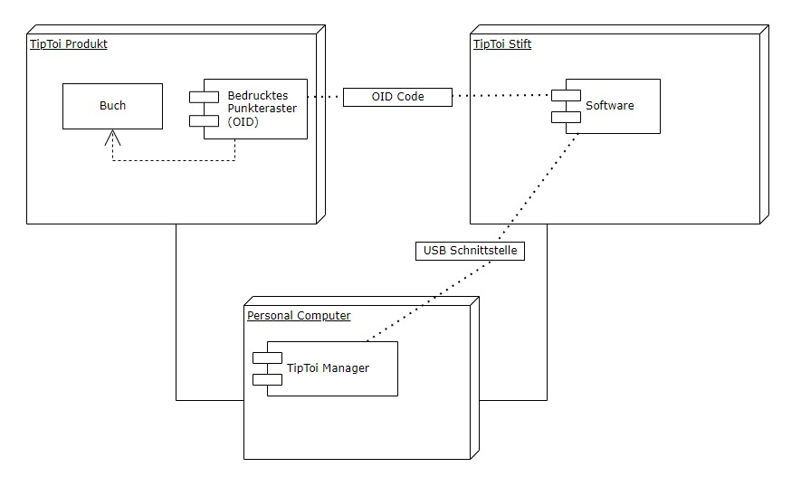

**Architekturdokumentation der Software *TipToi***

# Einführung
<!--
Diese Vorlage einer Architekturdokumentation ... ist eine vereinfachte und angepasste Version der Vorlage arc42[^1] sowie . 
-->
Mit TipToi soll Kindern, unter anderem solche die noch nicht fliessend lesen können, die Möglichkeit geboten werden spielerisch dinge zu lernen. Dazu wird ein «Stift» mit einem Infrarotsensor an seiner Spitze und einem Lautsprecher am anderen Ende eingesetzt. Der Stift kann mit dem Infrarotsensor von einem codierten Papier die Informationen entnehmen, welche er benötigt, um mittels Software zu wissen welche Audiodatei er über den Lautsprecher ausgeben kann. Dies geschieht anhand eines bedrucktem Punkteraster (OID), welche es in jeglicher Form gibt. Beispielsweise als Buch, Puzzle, Figuren, GLobus, etc. Für das Kind ergibt dies einen «Ziele auf das Bild und erhalte eine Erklärung» Effekt. Die Oberfläche, welche ein bedrucktes Punkteraster (OID) hat, kann vom Infrarot-Scanner des tiptoi Stift ausgelesen werden.

# Kontextabgrenzung

- Das System besteht aus 2 Teilen: Dem TipToi Stift und den codierten Seiten
- Der TipToi Stift kann mit einem USB Kabel an den PC angeschlossen werden. Um neue Audiodateien zu installieren.
- Die codierten Seiten werden durch den Infrarotsenor im TipToi Stift gelesen
- Je nach Code wird die benötigte Audiodatei abgespielt

# Anforderungen
## Funktionale Anforderungen
- Das Kind muss den Stift einschalten können
- Das Kind muss den Stift ausschalten können
- Das Kind muss das Buch Initial scannen können
- Das Kind muss die im Buch vorhanden Codes scannen können
- Die Eltern müssen die Batterien einsetzen können
- Die Eltern müssen die Software bedienen können
- Der TipToi Manager lädt die Software auf den Stift via USB Verbindung

## Qualitätsanforderungen
-	Der Stift muss mittels der Software eine oder mehrere Audiodateien eindeutig einem Code zuweisen können.
-	verarbeiten können.
-	Die Software soll nicht abstürzen.
-	Der Stift muss die verschiedenen Dateien voneinander unterscheiden können. 
-	Der Stift muss von einem Kind bedient werden können. 
-	Der Stift muss der Handhabung eines Kindes standhalten. 
-	Die codierte Hardware sollte robust genug für die Handhabung eines Kindes sein. 
-	Die Codierung auf dem Papier darf nicht zu auffällig sein, jedoch auch noch vom Stift lesbar sein. 

## Randbedingungen
<!-- *Anforderungen, Vorgaben, welche das Team beim Design der Software einschränkt* -->
- Da der Stift nicht unendlich Speicherkapatzität hat, sollte die Software nicht zu gross sein
- Jede codierte Hardware muss einen eindeutigen Idenifizierungscode haben
- Es muss beachtet werden, dass die Software mehrsprachig ist

# Verteilungssicht
<!--*Verteilungsdiagramm + Beschreibung*-->
- Der Personal Computer wird per USB Schnittstelle mit dem Stift verbunden
- Der TipToi Manager übergibt die Software dem TipToi Stift
- Der TipToi Stift list den OID Code aus dem TipToi Produkt

# Glossar
OID Code = (optical identification) - Oberfläche mit einem bedrucktem Punkteraster 

<!-- Dieser Abschnitt ist auskommentiert
[^1]: www.arc42.de
-->

