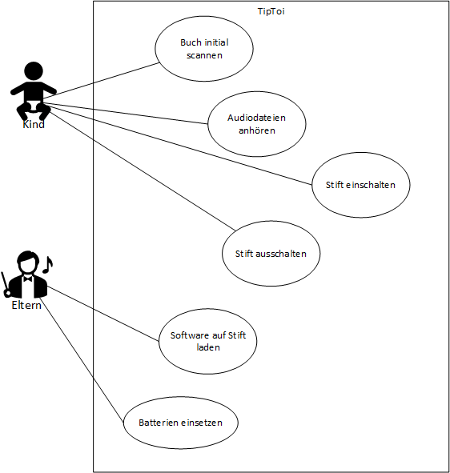

**Architekturdokumentation der Software *Tiptoi***

# Einführung
<!--
Diese Vorlage einer Architekturdokumentation ... ist eine vereinfachte und angepasste Version der Vorlage arc42[^1] sowie . 
-->
Mit TipToi soll Kindern, unter anderem solche die noch nicht fliessend lesen können, die Möglichkeit geboten werden spielerisch dinge zu lernen. Dazu wird ein «Stift» mit einem Infrarotsensor an seiner Spitze und einem Lautsprecher am anderen Ende eingesetzt. Der Stift kann mit dem Infrarotsensor von einem Codierten Papier – meist in Form eines Buches – die Informationen entnehmen, welche er benötigt, um mittels Software zu wissen welche Audiodatei er über den Lautsprecher ausgeben kann. Für das Kind ergibt dies einen «Ziele auf das Bild und erhalte eine Erklärung» Effekt. 

# Kontextabgrenzung
*Kontext-Diagramm und Beschreibung.*

# Anforderungen
## Funktionale Anforderungen
*Use Case- Diagramm + Beschreibung*

## Qualitätsanforderungen
-	Der Stift muss mittels der Software eine oder mehrere Audiodateien eindeutig einem Code zuweisen können.
-	verarbeiten können.
-	Die Software soll nicht abstürzen.
-	Der Stift muss die verschiedenen Dateien voneinander unterscheiden können. 
-	Der Stift muss von einem Kind bedient werden können. 
-	Der Stift muss der Handhabung eines Kindes standhalten. 
-	Die codierte Hardware sollte robust genug für die Handhabung eines Kindes sein. 
-	Die Codierung auf dem Papier darf nicht zu auffällig sein, jedoch auch noch vom Stift lesbar sein. 

## Randbedingungen
*Anforderungen, Vorgaben, welche das Team beim Design der Software einschränkt* 

# Verteilungssicht
*Verteilungsdiagramm + Beschreibung*

# Glossar

<!-- Dieser Abschnitt ist auskommentiert
[^1]: www.arc42.de
-->

